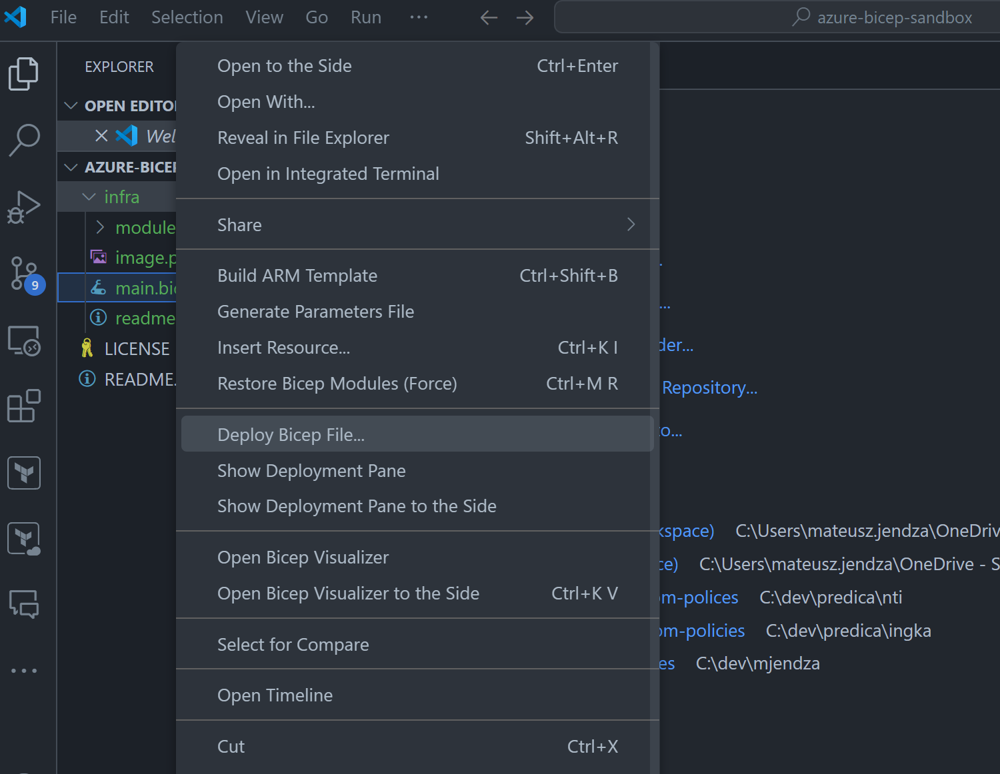

# azure-bicep-sandbox
Full end to end solution from Firewall (FrontDoor) to application

## How to deploy the infrastructure
1. Use VS Code with the Azure Bicep extension installed.
2. Open the `infra` folder in VS Code.
3. Right click on the `main.bicep` file and select `Deploy Bicep File`.

## Infrastructure
- Azure Front Door (Standard tier)
- AppService (Free tier) - 2 instances Blue and Green
- MS SQL with managed identity

## DemoApp (AppService)
- Asp.Net Minimal API (C#) with a simple API (WeatherForecast)
- ENV configuration dedicated for Blue and Green deployment - to check (if FrontDoor is applying the correct routing - rule)
- env configuration per each deployment (bicep)
- DemoApp.http file to make a local test
- launchSettings.json for Blue and Green deployment

## MS SQL Module
- The MS SQL module is defined in `infra/modules/sql.bicep`.
- It includes a SQL server and a database with managed identity.
- The connection string for the SQL server is outputted for use in other modules.

## Instructions for deploying the new MS SQL module
1. Ensure you have the necessary parameters for SQL server name and database name.
2. Open the `infra/main.bicep` file.
3. Add the MS SQL module with the required parameters.
4. Deploy the `main.bicep` file using the Azure Bicep extension in VS Code.
