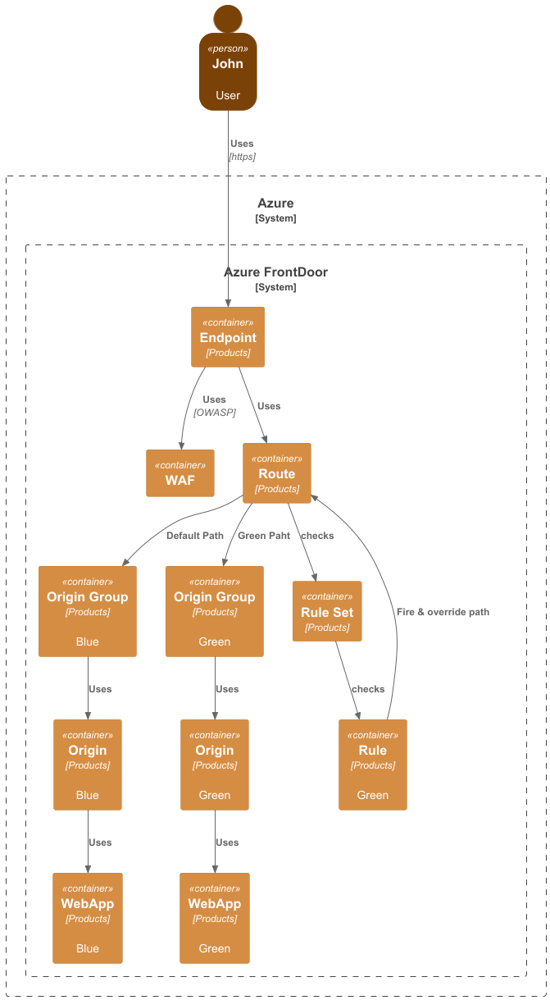
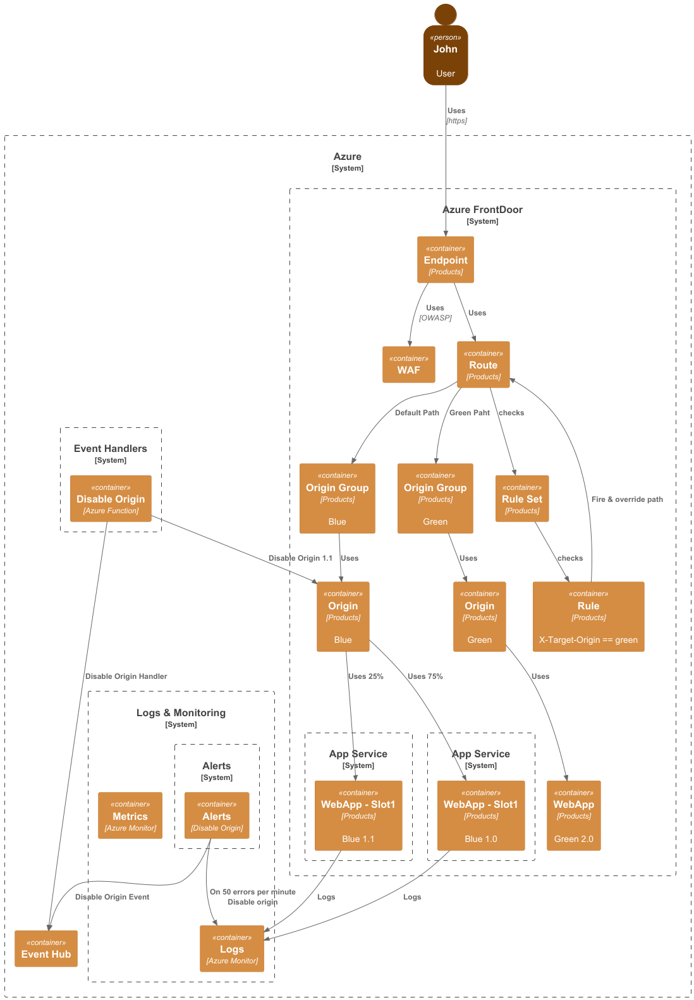

# Blue-Green Deployment

### Submitters
List ADR submitters.
- MJendza

## Change Log
- [Pending](https://github.com/mjendza/azure-bicep-sandbox/pull/3) 2024-10-07 by @mjendza

## Referenced Use Case(s)

## Context
Expected behavior:
- Improve deployment process - reduce downtime and risk.
- Improve the ability to rollback changes.

## Proposed Design

### Basic case

FrontDoor RuleSet decision to route traffic to Blue or Green deployment origin.
When deploying a new version, the FrontDoor Rule can override the routing to the new deployment origin based on the `X-Target-Origin` header and value `green`. A consumer for the system can change the header value to `green` to route the traffic to the Green deployment origin. The automated test on the pipeline can check the new deployed service also.

### Version 2 (V2)
As an extension to the basic case with the Version2 (V2) the FrontDoor can use two origins for the same Origing Group and route the trafic based on the defined rule like 75% to 25%). In the case of the errors with the 1.1 version, the traffic can be routed to the 1.0 version based on the alert, event bus and automation.

## Considerations

### Expensive - Possible reductions:
#### Slot deployment (Azure App Service)
##### Pros
  - Easy to implement
  - No additional costs
##### Cons
  - Not fully isolated - same .Net Core version, KeyVault, etc.

## Decision
First implementation should follow the basic case. The V2 can be implemented later.

## Other Related ADRs
Empty

## References
- https://newsletter.fractionalarchitect.io/p/30-worth-to-know-common-deployment

